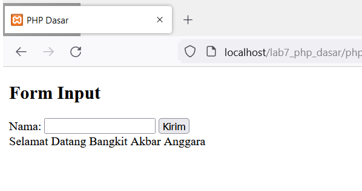
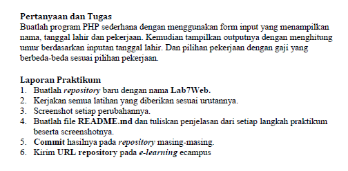

# Lab5Web

Nama  : Bangkit Akbar Anggara 
NIM   : 312010148 
Kelas : TI.20.B.1 

Berikut adalah tugas Pemrograman Web Lab5Web 
 
Berikut adalah htmlnya 
 
Berikut adalah hasilnya 
 

### Javascript Dasar
- Pemakaian Alert sebagai property window. 
  Berikut adalah htmlnya 
   
  Berikut adalah hasilnya 
   
- Pemakaian method dalam objek. 
  Berikut adalah htmlnya 
   
  Berikut adalah hasilnya 
   
- Pemaikaian prompt 
  Berikut adalah htmlnya 
   
  Berikut adalah hasilnya 
   
   
- Pembuatan Fungsi dan Cara Pemanggilannya
  Berikut adalah htmlnya 
   
  Berikut adalah hasilnya 
   
### Dasar Pemrograman di Javascript
- Operasi dasar aritmatika 
  Berikut htmlnya 
   
  Berikut adalah hasilnya 
   
   
- Seleksi kondisi (if..else) 
  Berikut adalah htmlnya 
   
  Berikut adalah hasilnya 
   
   
   
   
- Penggunaan operator switch untuk seleksi kondisi 
  Berikut adalah htmlnya 
   
  Berikut adalah hasilnya 
   
   
   
### Pembuatan Form
- Form Input 
  Berikut adalah htmlnya 
   
  Berikut adalah hasilnya 
   
   
- Form Button 
  Berikut adalah htmlnya 
   
  Berikut adalah hasilnya 
   
   
   
   
### HTML DOM
- Pilihan menggunakan checkBox dengan perhitungan otomatis 
  Berikut adalah htmlnya 
   
  Berikut adalah hasilnya 
   
   
# Pertanyaan dan Tugas
 
# Jawaban
Berikut adalah htmlnya 
 
Berikut adalah hasilnya 
 
#### By: Bangkit Akbar Anggara - 312010148 - TI.20.B.1
